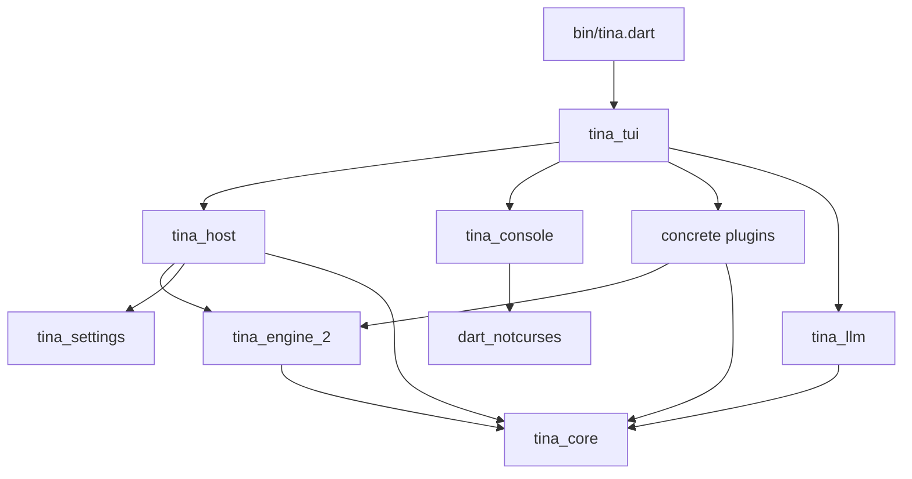

# Tina architecture

The root executable runs engine2. The former `tina_app`, `tina_engine` and
root application implementation are retired; their sources remain in Git
history. `lib/` contains only the generated release version.

## Package map

```text
bin/tina.dart                       CLI entry point
lib/version.g.dart                  generated release version
packages/
  tina_core/                        shared contracts and session log values
  tina_engine_2/                    agent loop and one AgentPlugin interface
  tina_host/                        session lifecycle and plugin loading
  tina_llm/                         provider transports and model catalog
  tina_tui/                         app assembly, CLI, settings and panels
  tina_console/                     rendering, editor, completion and UI seams
  tina_sqlite/                      generic SQLite and JSON Lines primitives
  classification/                   input classification, judgments and learning
  dart_notcurses/                    vendored native backend (Git submodule)
  libraries/
    tina_settings/                  generic scoped settings contracts
    fuzzy_ranker/                   fuzzy ranking
    file_tree/                      retained filesystem tree library
    attractor/                      retained workflow implementation
  plugins/
    tina_tools/                     filesystem, commands, jobs and OS sandbox
    tina_mode/                      permission modes and auto-approval policy
    tina_approvals/                 generic approval requests and channels
    tina_approvals_tui/             terminal approval presentation
    tina_providers/                 routing, rates and token limits
    tina_persistence/               SQLite sessions and legacy import
    tina_plans/                     plan state, tools and console panel
    tina_goals/                     goal state and execution policy
    tina_compaction/                automatic and manual compaction
    tina_subagents/                 child sessions and scheduling
    tina_file_resources/            file resources and skill folders
    tina_system_instruction/        base system prompt contribution
    tina_step_limit/                optional round limit
    tina_self_update/               update checking and installation
    tina_chat_tui/                  conversation presentation and UI contributions
    tina_activity_tui/              optional detailed activity browser
    tina_grok_guard/                example input approval plugin
    tina_mcp/                       MCP connections and discovered tools
    tina_index/                     retained, disconnected repository index
    tina_workflows/                 retained, disconnected Attractor plugin
```

Package directories and plugin IDs are different things. A package can supply
several plugins or console contributions. IDs use `publisher/name`; `tina/` is
reserved for first-party plugins. Every registered definition supplies a
nonempty user-facing description and declares its capabilities and settings.
The classification plugin lives in the single `packages/classification` package.

## Dependency direction



This shows the principal runtime directions, not every plugin dependency.
`tina_engine_2` depends only on `tina_core`. `tina_host` depends only on core,
engine2 and the generic settings library. Neither can depend on a concrete
plugin, even through an adapter. The loop never imports the host or terminal.
The root runtime manifest depends only on `tina_tui`.

`tina_tui` is the application assembly: it registers available implementations,
resolves configuration, constructs providers and injects capabilities. The host
loads definitions and owns session lifecycle without knowing concrete features.
Provider transports live in `tina_llm`; routing, rates and spending policy live
in `tina_providers`.

## Loop and feature policy

The loop is in `packages/tina_engine_2/lib/src/loop.dart`. It accepts input,
builds a request, consumes the provider stream, dispatches tools, records their
results and repeats until the turn ends. The session log is authoritative;
requests and resumable transcript views are derived from it. Plugins cannot
rewrite the durable transcript directly.

One `AgentPlugin` interface covers session lifecycle, tool schemas, executors,
commands, prompt sections and turn hooks. Hooks can be asynchronous. The loop
awaits them in order, passes a copied context and discards failed context writes.
Enforcement failures stop the affected operation; cancellation preserves tool
call/result pairing. The loop pins tool schemas after `prepareTurn`, which lets
MCP finish discovery before a request is built.

Plan, goal and mode state belong to their plugins. Generic plugin-state entries
carry those values through persistence without teaching core their schemas.
The loop has no default step ceiling; `tina/step-limit` is an optional plugin.
Commands are dispatched by the host, not by the loop.

Tools contribute both schemas (sent to the model) and prompt guidance. The tools
plugin owns OS confinement, filesystem/process permission checks, background
jobs and process-tree cancellation. It receives an abstract approval requester;
it does not construct terminal dialogs.

## Approvals and console contributions

`tina_approvals` supplies pending request state, typed requester/channel
contracts and cancellation handling. The selected channel receives each request;
`tina_approvals_tui` renders it. Another channel can deliver the same request
through an external service without changing the loop or tool plugin. The mode
plugin owns ask/read-only/allow-edits/auto policy and remembered grants.

UI-capable plugins implement `ConsoleContribution`. The app discovers that
interface on loaded plugin instances, attaches their registrations through a
`ConsoleContext`, and removes them when a plugin unloads or a session closes.
Settings sections, status contributions, key bindings, commands, modals and
sidebar panels use these generic seams. The host and loop do not need terminal
imports. Shared sidebar allocation prevents independent panels from overlapping;
menu bounds use preferred dimensions clamped to the terminal viewport.

See [UI contributions](docs/ui-contributions.md),
[scoped settings](docs/engine2-settings.md) and
[mode policy](packages/plugins/tina_mode/README.md).

## Persistence and configuration

`tina/persistence` owns saved sessions and their SQLite schema, using
`tina_sqlite` primitives. Sessions with no meaningful activity are not listed.
The legacy importer is part of this plugin and has no dependency on the retired
packages. It reads original files without modifying them and writes independent
engine2 sessions; unsupported historical metadata remains archival.

The application reads global TOML from `~/.tina/config` (or `--config`), workspace
TOML from `<workspace>/.tina/config`, and persisted session overrides. Settings
definitions declare which scopes are applicable; resolution is Session,
Workspace, Global, then defaults. Plugin selection follows the same scoped model.
Only registered implementations can be selected; configuration does not download
or execute new Dart packages.

See [configuration](docs/engine2-config.md),
[compatibility audit](docs/engine2-config-audit.md), and
[session import](docs/engine2-session-import.md).

## Retained packages and historical documents

Attractor and `tina_workflows` remain connected to each other for future work,
but cannot be reached by the app. `tina_index` is also disconnected. Existing
classification judgment/exploration APIs are retained, while repository indexing
and classification await redesign. User-input classification and its live panel
are active features.

The old feature documents under `docs/features/` and legacy proposals describe
historical designs; their deleted source paths can be found in Git history.
They do not define the current runtime. The
[migration guide](docs/engine2-migration.md) records compatibility limits and
intentional exclusions, including the old session-command surface.

## Enforcement and verification

`tool/architecture/policy.json` lists every owned package, its source roots,
package path, runtime boundaries and deferred dependencies. The checker validates
manifests and source import graphs, including conditional imports. New packages
must be classified and covered by CI. Exact baseline exceptions remain only for
retained diagnostic probes that intentionally reach console internals.

Root tests check the executable's full import closure, configuration's terminal
boundary, plugin-free host/loop dependencies, feature-state ownership and CI
coverage. Each retained package runs its own analysis and tests in CI. Release
builds exercise the compiled executable on a real PTY with local provider/MCP
fixtures, including startup, turns, cancellation, approvals, settings, persistence,
images and the live classification panel before packaging.
