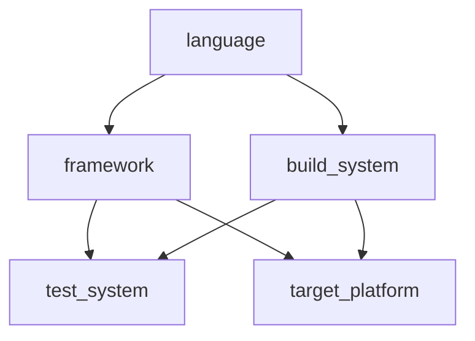

# Project classification

`/classify` discovers project scopes and classifies programming languages,
frameworks, build systems, test systems and target platforms. `/classify status`
validates/restores saved results without model calls or writes. `/classify refresh`
reruns all work. The same commands work with `tina --prompt`; incomplete headless
runs exit nonzero. TUI double-Esc and headless Ctrl+C cancel. Nothing runs on
startup, and `/index` remains independent.

The reusable API is documented in [classifier](../../packages/classifier/README.md).
The project feature is an application recipe built on that API. Paths, repository
queries, scope discovery, label types and built-in classifier definitions live in
`packages/tina_app/lib/src/classification`. The generic classifier package has no
knowledge of programming languages, files, paths or a mandatory discovery phase.

## Source preparation

`RepositoryEvidenceReader` supplies bounded Git enumeration and confined file
reads. `RepositoryTextSource` selects and encodes that data as `TextEvidence`:

- `RepositoryProjection.filenames` emits only repository-relative filenames.
  File content edits do not invalidate this projection; additions/removals do.
- `RepositoryProjection.filenamesAndContents` emits filenames plus contents of
  selected manifests/configuration files. Selection names/suffixes and the raw
  input encoder are configurable and versioned independently of classifiers.

`runProjectClassification` accepts the projection programmatically; the command
uses filenames plus the selected manifest/configuration contents. No arbitrary
source-file reading is performed by the agent. An application can supply another
source or encoder without changing the classifier or engine adapter.

Every input unit carries a stable evidence ID, a meaning, and location metadata.
The source tracks listing and content dependencies and validates their freshness.
Complete coverage means complete coverage of the declared projection, not an
assertion that every file's contents were inspected. Skipped/unreadable selected
content is reported as incomplete coverage, never as absence.

Git enumeration includes non-ignored untracked files and excludes deleted tracked
files. Inventory is capped at 20,000 paths and 2 MiB. Collection excludes common
vendor/build directories and secret-file names. Selected content is capped at
64 files and 1 MiB total, with 128 KiB per file. File reads reject symlinks and
binary data. Existing `read`/`glob` deny rules apply during source preparation.
This implementation requires a Git repository.

## Classification and hierarchy

The scope agent returns `ProjectScopes`. Each discovered scope records its
nearest parent; child scopes are excluded from the parent's own source view.
The remaining agents return `ProjectLabels`. Their dependency graph is:

The source prepares evidence; agents interpret it. The generic engine adapter
receives typed prepared input and advertises only `submit_classification`, whose
output schema comes from the classifier's output contract. It has no file tools.
The normal engine driver, provider factory, permission checks, metering and pause
gate are reused. A valid submission ends the local turn without an extra model
request. The configured provider/model is used independently of chat history.

Small inputs use one request. Larger inputs are packed and, if necessary, split
into text excerpts with scalar offsets. Project-specific observation and
aggregation instructions combine supported findings and resolve conflicts while
preserving citations. Unknown/incomplete observations do not prove absence.
There is no implicit generic label union or confidence averaging.

Packing budgets the complete serialized request, with output and safety reserves.
The model catalog's context/output limits are used when known; the fallback
context is 32,768 tokens. Requests use at most 12,000 estimated input tokens and
4,096 output tokens (also constrained by configuration and model limits). The
estimator is conservative, not an exact provider tokenizer. Retries retain the
engine's input and turn guards. Default run limits are three concurrent calls,
128 classification calls, five minutes, and 120,000 recorded tokens, alongside
the application's shared limits. In-flight requests can finish after a spend
ceiling is reached.

## Persistence

`.tina/classifications/manifest.json` references immutable `records/<sha256>.json`
files. The directory is self-ignored and writer-locked. Each completed request,
including chunk observations and aggregation steps, is checkpointed. A final
record references those request records and stores typed output, coverage,
versioned provenance and an opaque source freshness receipt. Raw evidence text,
provider credentials and agent transcripts are not stored; endpoint identity is
hashed.

Restoration checks source freshness, contract/encoder/splitter/plan/agent/model
identities, budget configuration and prerequisite record identities. Relevant
changes invalidate dependent work; independent branches remain reusable.
Interrupted chunked work resumes from matching request checkpoints. Source
changes during execution prevent final publication. Incomplete discovery does
not delete previously known scopes. Old immutable records are retained; GC is
deferred. Old v1 records are cache misses under the new v2 schema.

The old environment workflow, startup setup prompt, `ENVIRONMENT.md` injection
and `/index` environment gating remain removed. Existing files are left unused;
legacy `[environment]` configuration values are preserved on save but ignored.
Experts and setup/build/test execution are outside this feature.
