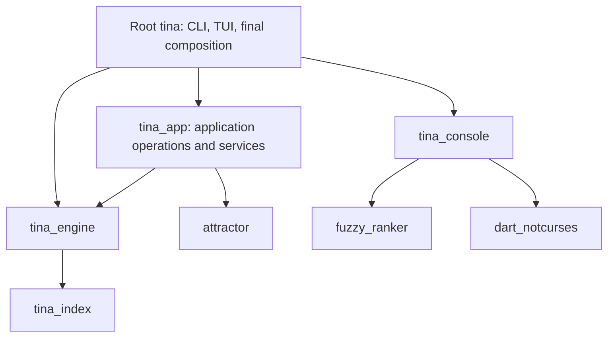

# Application architecture refactoring specifications

Status: A01–A08 all implemented. The A07 baseline stands at 26 exact
exceptions; remaining work is the ratchet, not new structure.
Start a new agent session with [the handoff](HANDOFF.md).
Date: 2026-09-08.

These specifications develop the review of `packages/` and `lib/` into
independently reviewable changes. They describe the intended implementation,
compatibility constraints, migration steps and evidence required for completion.
Proposed type names and signatures are illustrative, not existing APIs.

## Objective

Keep the existing capability packages, isolate runtime state, and separate
application operations from terminal interaction. Most work happens within
existing packages first. A new `tina_app` package is the final enforcement of
boundaries that have already been established in code.

Success means that application behavior can be exercised using providers,
repositories and event sinks in memory, without terminal initialization,
process-wide configuration changes or nested application startup.

## Specifications

| ID | Specification | Principal result | Prerequisites |
| --- | --- | --- | --- |
| A01 | [Runtime isolation](01-runtime-isolation.md) | Scoped tools, provider construction and resource ownership | None |
| A02 | [Configuration separation](02-configuration-separation.md) | Runtime configuration has no terminal or CLI dependency | None; coordinate with A01 |
| A03 | [Application operations](03-application-operations.md) | Spawn, branch and model changes live outside TUI construction | A01, A02 for final migration |
| A04 | [Session orchestration](04-session-orchestration.md) | Separate turns, background jobs, commands and frontend input | A03 operation contracts; A05 job contracts |
| A05 | [Summary and environment services](05-summary-environment-services.md) | Inject repositories and agent-run factories | A01, A02 for final migration |
| A06 | [Application package extraction](06-application-package.md) | `tina_app` enforces the frontend-independent boundary | A01–A05, A07 |
| A07 | [Dependency enforcement](07-dependency-enforcement.md) | Check direct and transitive dependency rules | None; ratchet with each migration |
| A08 | [Package CI coverage](08-package-ci.md) | Explicit independent validation for owned packages | None; extend for A06 |

## Intended dependency direction

Additional dependencies on neutral utilities are permitted when actually used.
No application or engine path may reach the terminal packages, and no reusable
package may depend on the root application. This is not a proposal to split
each engine subsystem into a package.

## Delivery sequence

1. Land A08 and an A07 baseline. Record existing violations explicitly; do not
   make the baseline green by silently omitting files.
2. Land A01 and A02 in small changes with compatibility adapters. Establish
   explicit ownership before moving application operations.
3. Land A05 and A03. These can be implemented independently once the factories
   and configuration types are agreed.
4. Land A04, consuming the operation and background-job seams.
5. Remove transitional adapters and enforce the intended module graph.
6. Land A06 as a predominantly mechanical move. Add its CI job in the same
   change and delete redundant root implementations.

Each implementation PR must name the specification and completed acceptance
criteria. No release, tag, package publication or deployment is part of this
documentation task or implied by these proposals.

## Compatibility rules

- Preserve CLI flags, TOML keys, resolution precedence, command aliases, help
  ordering, prompt text, transcript semantics and persisted session formats.
- Preserve permission policy, safe-mode tool filtering, sandbox behavior,
  cancellation semantics and model resolution on resume.
- Preserve current spend-accounting behavior during structural moves. Changing
  background work from separate budgets to a shared enforcement budget is a
  separate behavioral decision; factory APIs must make the choice explicit.
- Keep frontend integration tests that verify terminal behavior. Move policy
  and application-operation assertions to smaller tests as ownership changes.
- New cleanup and isolation guarantees must be tested. If they alter an
  observable failure path, describe that correction explicitly in its PR.

## Relationship to previous proposals

[Internal extension seams](../plugin_architecture.md) remains useful context.
Its command-registry work is already reflected in the current source: these
specifications narrow handler dependencies rather than propose another registry.
These proposals do not introduce a plugin loader, public extension protocol or
general application event bus. A04 introduces only lifecycle signals with
identified consumers: hosts and turn supervisors.

[Application provider composition](../app_composition_provider.md) describes
earlier provider ownership work. A01 preserves conversation-owned provider
instances and extends isolation to construction policy and tool resources.

## Completion evidence

The program is complete when each specification's acceptance criteria passes,
application tests run without native terminal dependencies, two runtime scopes
can coexist without configuration leakage, and all owned packages have explicit
CI test coverage. Smaller files alone do not establish completion.
