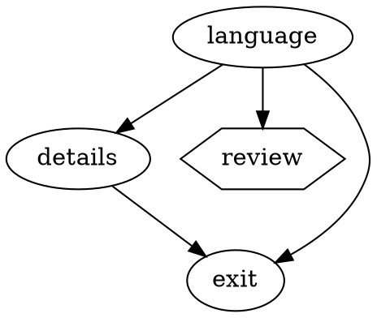

# Hierarchical classifiers — answer-routed classifier programs

Status: PROPOSED — decisions locked (see [Decisions](#decisionslocked-2026-09-23));
implementation in progress. Anchors verified against `main` @ `2cd3bc8`
(2026-09-23).

## Goal

The classifier framework is meant to absorb work the main-agent LLM would
otherwise do inline: triage → specialize → escalate chains where each stage is
a cheap, deterministic, structured judgment. This proposal makes the chaining a
first-class abstraction: **if the answer to classifier A is X, route to
classifier B** — expressed as data, checkpointed per stage, loadable from the
workspace.

**Core decision: the control plane already exists — `packages/attractor`.** A
classifier program is an attractor graph whose nodes are classifier stages.
The earlier draft of this doc proposed inventing a `RoutePredicate` AST, a
program scheduler, and a loop-budget policy; every one of those already exists
in attractor in a more battle-tested form. This revision is about composing the
two engines, not merging them.

## The two engines are different animals — do not merge

| | attractor (`PipelineEngine`) | classifier (`ClassificationSession`) |
|---|---|---|
| Execution model | sequential FSM walk from start node; cycles allowed, budgeted (`engine.dart:108-216`) | static parallel DAG; cycles rejected (`orchestrator.dart:372`) |
| Node unit | one handler: LLM call, human gate, tool, parallel fan-out | one task = a whole plan (chunked requests + code reductions) |
| Routing state | stringly `Context` (`Map<String, String>`) | typed `DataContract` records + fingerprinted `upstream` |
| Predicate | `Condition` DSL: AND of `key=value` / `!=` / truthy (`condition.dart:19-40`) | none — this is the gap |
| Persistence | `RunStore` audit trail + run-position checkpoint | content-addressed request/task records, `SourceRevision` freshness |
| Budgets | loop budgets: node visits, total steps, gate jumps (`engine.dart:89-138`) | token budgets: `ClassificationBudget`, `SpendLedger` |
| Parallelism | `component`/`tripleoctagon` parallel handlers | level-parallel workers with concurrency slots |

Sharing the *engines* would be forced: `runGraph` is a ~60-line topological
levelizer for typed parallel dispatch; `PipelineEngine` is a state-machine
interpreter for sequential control flow. They solve different problems. What
overlaps — and what this doc earlier would have duplicated — is everything
*around* them: predicates, routing policy, loop guards, validation, format,
authoring UX.

## What attractor already provides (verified)

- **Edge model** — `PipelineEdge {from, to, label, condition, weight}`
  (`graph.dart:117-151`): exactly `Route {from, when, to}` from the earlier
  draft, plus label/weight fallbacks we hadn't designed.
- **Condition DSL** — `Condition.tryParse` (`condition.dart:19-40`), evaluated
  against `Outcome` + `Context`; keys `outcome`, `preferred_label`,
  `context.*`.
- **Edge-selection policy** — the 5-step `_selectEdge`
  (`engine.dart:315-363`): condition matches → (fail stops here) → preferred
  label → suggested ids → weight → lexical. Subtle rules already encoded:
  a failed node routes **only** via an explicit `outcome=fail` condition,
  never by label fallback (`engine.dart:333-336`,
  `condition.dart:13-15`) — precisely the failure-routing semantics this
  proposal's open decision #4 asked about.
- **Loop budgets** — hard `max_node_visits` (the only cyclic-graph guard),
  soft `max_steps`, goal-gate retry budgets, and an interactive host hook
  `onLoopBudgetExceeded` (`engine.dart:96-138, 386-390`) — open decision #5,
  already solved, including the headless-vs-interactive split.
- **Validator** — start/exit, reachability, condition syntax, unknown context
  keys (`validator.dart:34-169`) — programs get static checking free.
- **Format + authoring** — DOT parse/write (`dot_parser`/`dot_writer`), ASCII
  renderer, and a full TUI editor/viewer (`lib/tui/workflow_editor_overlay.dart`,
  `workflow_viewer_overlay.dart`, `workflow_node_attr_form.dart`). Graphs live
  in `~/.tina/workflows/*.dot` (`bin/tina.dart:446`,
  `tui_coordinator.dart:1146-1158`); example:
  `examples/workflows/plan_review_execute.dot`.
- **Handlers** — start, exit, conditional, **human gate** (`wait.human`, wired
  via `tina_interviewer.dart`), parallel/fan-in, codergen.
- **Composition precedent** — `tina_app/src/workflows/pipeline_runner.dart`:
  "Assembles the attractor engine with tina's two seams" (`TinaCodergenBackend`,
  `FileRunStore`). The `classify` stage handler from this doc is the third seam,
  wired the same way, in the same package.

The human gate matters more than it looks: **escalation to a human is already
a node type.** A judgment program can route `outcome=unknown` to a `hexagon`
gate and resume afterwards — no new machinery.

## Proposed shape: classifier programs as attractor graphs

A program is a DOT graph; a node is a classifier stage; an edge condition
routes on the stage's published summary. Stage = one
`ClassificationOrchestrator.run` (its existing `runGraph`/`runTree` machinery,
unchanged), so all checkpointing, metering, cancellation and freshness stay in
the classifier where they belong.

- **New `classify` NodeHandler in `tina_app`** (sibling of
  `TinaCodergenBackend`): executes one stage, maps its result to `StageStatus`,
  publishes summary keys into `Context` for edge conditions (below), and
  applies its own token/metering budgets inside the node — same split as today,
  where loop budgets cap runaway *stages* and `ClassificationBudget` caps
  runaway *within* a stage. Engine `cancelSignal` bridges to
  `JudgmentCancellation` the way `classifyProject` already does.
- **Skip accounting**: no matching edge ⇒ the walk ends at that node
  (`_selectEdge` returns null ⇒ `_terminalOutcome`, `engine.dart:204-214`).
  Unrouted stages simply never run; the program report derives from the
  engine's `completedNodes` audit trail — no `report.skipped` needed.
- **Loop/revisit semantics**: a re-visited stage with unchanged upstream
  restores its content-addressed record for free (cheap loops), and the
  engine's hard `max_node_visits` cap stops true cycles — the two budget
  systems compose rather than duplicate.

### Context keys: the one real extension needed

`Condition` is AND-of-equality against strings. Classifiers answer with label
*sets*, coverage and outcomes. Two options:

1. **Publish booleans** — the handler emits `label.dart=true`,
   `coverage.complete=true`, `outcome.classified=true` per candidate. Works
   with `Condition` **today, zero DSL changes**; O(candidates) keys (~27
   framework candidates — fine).
2. **Extend `Condition`** with a membership clause (`labels~=dart` or
   `labels in (dart, typescript)`). Cleaner for large vocabularies, benefits
   workflows too, but touches the shared DSL.

Recommendation: option 1 for v1 (ship programs without touching attractor's
core), option 2 later if publishing keys gets verbose.

### Identity and invalidation

Unchanged from the classifier's existing model: each stage's records are
content-addressed over provenance including injected `upstream`
(`orchestrator.dart:230-244, 404-408`). Editing an edge in the DOT file
changes *which* stages run and with what upstream — upstream changes
invalidate exactly the downstream checkpoints they should, via canonical
fingerprints already in use. The program graph itself is not part of task
signatures; stage inputs are.

### Loading from the workspace

DOT files already are the format. Proposal: programs load from
`<repo>/.tina/programs/*.dot` (workspace-specific judgment chains) with
`~/.tina/workflows/*.dot` remaining for global ones — mirroring the existing
per-workspace split (`<repo>/.tina/classifications/` vs `~/.tina/config`).
The existing validator gates loading; the existing TUI editor edits them.

### Scope boundary: per-subject routing stays in-stage (v1)

Atractor's walk is one FSM; the repository tree has thousands of subjects.
Per-directory candidate selection (dart directory ⇒ flutter candidates)
remains parameterization *inside* the language/framework stage, exactly as
`frameworkCandidates` does today (`technology_classifiers.dart:73-86`).
Program-level edges sequence *stages* over the whole workspace. Finer
per-subject routing (a program walk per subject) is explicitly out of scope;
if it's ever needed, the stage handler can host a sub-walk internally.

### Honest cost: stage parallelism

`classifyProject` runs framework + tooling trees concurrently
(`project_classification_workflow.dart:80-98`). A single sequential FSM walk
loses that. Options: (a) both classifications live in one stage node (they
already share a source and store), (b) attractor's `component` parallel
handler fans out two stage nodes, (c) accept sequential — both branches hit
the same Typesafe service, so sequential may suit rate limits at the price of
wall time. Decide at migration time; none requires new machinery.

## Why not the reverse (classifier graph drives attractor stages)?

Attractor-as-control-plane keeps the *shared, human-facing* layer (format,
editor, validator, conditions) in the package that already owns it, and the
*specialized* layer (typed contracts, content-addressed caching, metering,
freshness) in the package whose charter says "independent of the agent
runtime" (`packages/classifier/pubspec.yaml`). Dependency direction stays
clean: `classifier` gains **no** dependency on `attractor`; `tina_app` composes
both — the same seam where `classifyProject` and `workflow_supervisor` live
today.

## Could they share an underlying graph package?

Split "graph abstraction" into three layers, because only one is genuinely
common:

1. **Structure** (shareable in principle) — nodes, edges, ids, adjacency
   queries, reachability, topological levels, cycle detection, diagnostics.
   Attractor has `Graph`/`PipelineNode`/`PipelineEdge` + `_reachableFrom` +
   the `validator`; the classifier has the inline leveling + cycle check in
   `runGraph` (`orchestrator.dart:360-376`) and `TreeSnapshot`'s BFS
   validation (`tree.dart:47-64`). Together ≈100–150 lines.
2. **Edge semantics** (not shareable) — attractor edges *route* (condition,
   label, weight; cycles allowed and budgeted at runtime); classifier
   `requires` edges are plain prerequisites (cycles statically rejected);
   tree edges are single-parent spatial containment. Note the policies are
   even opposite on the same structural question (cycle: allow vs. reject) —
   a shared core would supply *detection* as a primitive while each caller
   keeps its own policy.
3. **Execution** (not shareable) — sequential FSM walk with loop budgets vs.
   level-synchronous parallel workers vs. leaf→root tree merges.

`TreeSnapshot` specifically should not be forced through a generic graph
core: its invariants (one parent, no shared children, sorted children for
stable keys, reversed level list) are tree-shaped validation that a generic
adjacency type would either lose or re-express as policy layers.

**Decision: no extraction now.** The duplicated-code risk on this path was
never adjacency storage — it was *routing predicates*. After this proposal
there is exactly one of each on the execution path: one format (DOT), one
condition evaluator (`Condition`), one routing policy (`_selectEdge`), one
structural validator. The classifier's `runGraph`/`TreeSnapshot` are small,
execution-coupled schedulers, not a second graph library. The sharing
points that matter sit *above* both engines at the `tina_app` composition
layer: DOT files, condition strings as data, and attractor's handler
registry mapping node id → stage (`registry.resolve` — the same seam
`classify` joins).

**Extraction trigger:** when route evaluation needs a second home — e.g.
the deferred per-subject routing (evaluating conditions *inside* a stage
against records). At that point refactor `Condition` to evaluate against a
`Map<String, String>` lookup instead of concrete `Outcome` + `Context`, and
move it plus the adjacency/topo/diagnostics core into a leaf package
(`packages/graph_core`) that both depend on. Direction stays clean: neither
engine depends on the other. Cost to weigh then: each package needs a
hand-written CI job (`test/architecture/ci_owned_packages_guard_test.dart`).

## Decisions (locked 2026-09-23)

1. **Condition membership — publish booleans (v1, no DSL change).** The
   `classify` handler emits flat keys (`label.dart=true`,
   `coverage.complete=true`, `outcome.classified=true`) so stock `Condition`
   evaluates programs today. A `~=`/`in` membership clause is a later,
   additive attractor change only if publishing keys proves verbose.
2. **Status mapping.** Stage → `StageStatus`:
   all requested records restored/classified and no task failures ⇒
   `success`; some task failures or incomplete-coverage records but at least
   one classified record ⇒ `partial_success` (engine treats as ok,
   `outcome.dart:60`, so edges without explicit conditions proceed); zero
   classified records and any failure/incomplete record, or an orchestrator
   error ⇒ `fail` (routes only via explicit `outcome=fail` edges).
   Context keys published by every stage: `outcome.<classified|unknown|
   not_applicable>=true` for the root record summary,
   `coverage.complete=true|false`, `label.<name>=true` per distinct label
   across records (capped at 64, the `ProjectLabels` ceiling), plus
   `stages_ok`/`stages_failed` integer counts for diagnostics.
3. **Program file locations.** Workspace programs:
   `<repo>/.tina/programs/*.dot`; global programs (and the built-in default
   fallback): `~/.tina/workflows/*.dot`. Mirrors
   `<repo>/.tina/classifications/` vs `~/.tina/config`. A workspace
   `index.dot` (or the single program file when only one exists) wins over
   the global default for `/index`.
4. **Stage parallelism — option (a): one `details` stage node.** The
   framework and tooling classifications share source, store, session and
   service today (`classifyProject` runs them in one `Future.wait` over the
   same tree); a single stage node runs both internally, preserving current
   wall time with a sequential FSM walk. Revisit (b) `component` fan-out only
   if a future program needs them separated.
5. ~~Loop policy~~ — **resolved**: engine visit/step budgets + host hook;
   content-addressed restore makes revisits cheap, the hard cap stops cycles.
6. ~~Failure-as-route~~ — **resolved**: `Condition.testsOutcome` already
   mandates explicit `outcome=fail` conditions for failure routing.

## First implementation slice

1. **`classify` NodeHandler** in `tina_app/src/workflows/` — wraps the existing
   `runConfiguredProjectClassification` composition, publishes summary Context
   keys, maps `StageStatus`, bridges cancellation. Unit-test against a fake
   orchestrator.
2. **Express today's `classifyProject` as a DOT program** — language →
   framework (`label.*` conditions) / tooling / exit, with a failure edge.
   Migration proof: checkpoint reuse across the rewrite (identical stage
   signatures), correct invalidation when an edge/upstream changes.
3. **Workspace loading** — resolve `<repo>/.tina/programs/*.dot`, run the
   existing validator, surface diagnostics.
4. **`/classifier-review` target** — proposals render as a DOT fragment the
   workflow editor can open; adopting a suggestion = editing the program file.

Not in scope: per-subject program walks, `Condition` DSL extension (unless
decision 1 picks it), classifier→attractor dependency, a UI beyond the
existing workflow editor.
