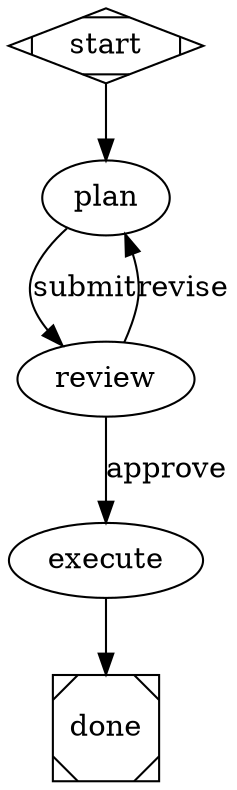

# Per-node system prompts and node handoff — design proposal

**Ticket:** tin-7spm (follow-up to tin-923l)
**Status:** Proposal / plan only — no code changes proposed for execution here
**Date:** 2026-08-07
**Author:** Nick Fisher

> This document is a **design proposal**, not an implementation plan. It answers two
> questions the ticket poses and gives a recommendation. It does not change any code or tests.
> File/line references are to the current `main` HEAD (`asb/explore-node-handoff` base) unless
> flagged as "PR #1" — PR #1 (`refactor(agent): unify workflow prompts`, tin-923l) is open and
> unmerged, and its pending changes are called out where they matter.

---

## 1. Goal and scope

tina routes normal chat turns through an editable DOT workflow (`~/.tina/workflows/default.dot`,
seeded from `kDefaultWorkflowDotSource` in `lib/pipeline/default_workflow.dart:116`). Two design
questions are open:

1. **Where do per-node *system* prompts live?** As a node attribute in the DOT file, or resolved
   from the node's role (the current arrangement)?
2. **How does one node hand off to another?** Hard-coded engine-enforced graph edges (today),
   system-prompt-directed delegation where the node agent itself decides to delegate (PR #1's
   direction), or a hybrid?

We explore both, anchor them to the concrete **main → reviewer** example, weigh them against
routing, determinism, auditability, flexibility, and UX, and deliver a recommendation.

This is **plan only**. Nothing here is implemented.

---

## 2. Current architecture (verified)

A single turn flows:

```
PipelineRunner.run()  (lib/pipeline/pipeline_runner.dart:43)
  -> parseDot(source)  (packages/attractor/lib/src/dot_parser.dart:15)   [hand-rolled parser]
  -> validate(graph)   (packages/attractor/lib/src/validator.dart:35)
  -> PipelineEngine.run()  (packages/attractor/lib/src/engine.dart:60)
       while current != exit:
         handler = registry.resolve(current)            (node_handler.dart:40)
         outcome  = handler.execute(current, ctx)        (codergen_handler.dart:18)
         current  = graph.node(_selectEdge(current, outcome, ctx).to)  (engine.dart:138)
```

### 2.1 Node model and attributes

`PipelineNode` (`packages/attractor/lib/src/graph.dart:11-72`) holds a raw `attrs` map with typed
getters. The instruction-related attributes today are:

| Attribute | Getter | Meaning |
|---|---|---|
| `role` | `role` (graph.dart:36) | tina role name; empty = host default. **First-class.** |
| `prompt` | `prompt` (graph.dart:32) | The *task* text for the turn; `$input`/`$history`/`$goal` expanded at runtime (codergen_handler.dart:108). |
| `model` | `model` (graph.dart:40) | Optional per-node `"provider/model"` override, threaded through to the scheduler (tina_codergen_backend.dart). |

There is **no** `system_prompt` / `instructions` / `system` attribute. Raw unknown keys are kept in
`attrs` and ignored by the engine, so adding one is non-breaking.

### 2.2 How a role becomes a system prompt

```
node.role  ->  TinaCodergenBackend.run()  (lib/pipeline/tina_codergen_backend.dart:34)
                 name = role.isNotEmpty ? role : defaultRole          (:42)   // defaultRole = 'orchestrator' on main; 'main' in PR #1
                 agentRole = pipeline.resolveRole(name)               // (PR #1) / pipeline.role(name)
                 scheduler.runStandalone(role: agentRole, ...)        (:~45)
                   -> resolveSystemPrompt(role, overrides: promptOverrides, ...)  (system_prompt.dart:77)
                        identity = overrides[role.name] ?? role.promptIdentity     (system_prompt.dart:80-83)
                        return _buildAgentPrompt(identity, <environment>, <project-context>)
```

System-prompt identity is therefore **exclusively role-derived**, as `const String`s in
`packages/tina_engine/lib/src/agent/agent_pipeline.dart:352-427` (e.g. `_mainIdentity` at :358,
`_verifierIdentity` at :406). The only override path is `overrides: Map<String,String>` keyed by
**role name** (sourced from `Config.promptOverrides`); it **replaces** the identity wholesale and is
not per-node.

### 2.3 Roles and delegation

`AgentPipeline` (agent_pipeline.dart:87) holds `mainRole` + `roles` + `workflows`. Catalog
(agent_pipeline.dart:242-350):

- Roles: `main`, `research`, `implementer`, `verifier`, `tester`, `orchestrator`, `scout`,
  `summarizer`.
- Workflow: `qa` (implement → verify → test, halts on failed review).
- Only `main` (canDelegate, :248) and `orchestrator` (canDelegate, :290) carry the delegate tool.

The **`delegate` tool** (`packages/tina_engine/lib/src/tools/delegate_tool.dart:21-62`; schema in
`delegation_base.dart:37-67`) takes `delegations: [{agent: <enum>, task: <string>}]`. The `agent`
enum is built live from `pipeline.delegateTargets` (roles + workflows). The **LLM picks the target**;
there is no engine routing. Fan-out capped at `kMaxDelegations = 8`; nesting capped at
`AgentQuota.maxDepth = 3`. (A `dispatch` sibling — detach/background — is mentioned in comments but
does not yet exist.)

### 2.4 Edge / handoff routing — the engine owns it

`_selectEdge()` (`packages/attractor/lib/src/engine.dart:229-268`) is the **sole** next-node decision
point. It is a five-step cascade:

1. **Condition edges** — edges whose `condition` expression evaluates true against
   `outcome.status` + context keys (engine.dart:235-243; `condition.dart`).
2. **`preferredLabel` match** — `outcome.preferredLabel` normalized and matched against outgoing
   edges' `label` (engine.dart:248-253; `_normalizeLabel` :281). This is how a `VERDICT: approve`
   line routes `review -> execute [label="approve"]`.
3. **`suggestedNextIds`** — an explicit node id the outcome suggests; matched against an
   unconditional outgoing edge (engine.dart:256-262). **Today only the human-gate handler sets this.**
4. **Weight** — highest `weight` among unconditional edges.
5. **Lexical** — by target node id (tie-break).

The verdict itself is scraped from the trailing `VERDICT: <label>` line of the agent's response
(`parseVerdict`, `tina_codergen_backend.dart:72-81`) and stored as `Outcome.preferredLabel`. **The
node agent never selects the next node directly**; it influences routing only through the `Outcome`
fields above.

### 2.5 The seed workflow on `main` (the canonical example)

`kDefaultWorkflowDotSource` (`default_workflow.dart:116-142`):



This already shows the **current hybrid in miniature**: *between* nodes the engine enforces edges via
`VERDICT` labels; *within* `execute` the orchestrator agent decides to call `delegate` to fan out to
implementer sub-agents.

### 2.6 What PR #1 (open, unmerged) changes

PR #1 (tin-923l) collapses the seed to a single delegating node and re-establishes a single source of
truth for identity:

- `defaultRole` `'orchestrator'` → `'main'` (`tina_codergen_backend.dart`); new
  `pipeline.resolveRole(name)` resolves `main` too (`agent_pipeline.dart`); `resolvableRoleNames`
  feeds workflow validation.
- New `defaultParentReference` (the live conversation model) threaded from `bin/tina.dart` and
  `lib/tui_coordinator.dart` so tier-less `main` inherits the user's model.
- `_mainIdentity` rewritten to "delegate directly to research/implementer/verifier/tester/orchestrator
  via the `delegate` tool."
- Seed DOT replaced by `start -> main -> done`, where `main`'s `prompt` says "plan, then delegate to
  specialist sub-agents."

Net effect of PR #1: the default path becomes **system-prompt-directed delegation only** (option B
below) — inter-node edges disappear for the default chat flow.

---

## 3. Question 1 — where should per-node system prompts live?

### 3.1 Options

**A. Role-only (status quo + PR #1).** System prompts live exclusively in the `AgentRole` catalog.
DOT nodes carry `role` (selects identity) + `prompt` (task). No per-node system prompt. tin-923l's
"single source of truth" position.

**B. Node-attribute system prompt (wholesale replacement).** Add a `system_prompt` attribute to DOT
nodes whose text **replaces** the role's `promptIdentity` for that node. Maximum per-node control,
reusing the existing `overrides` plumbing (just keyed by node id instead of role name).

**C. Layered (additive).** Role remains the single source of truth for *identity* (system prompt +
tools + model tier + canDelegate). A node may optionally carry an `instructions` attribute whose text
is **appended** to the role's `promptIdentity` — it tailors identity for this node without replacing
it. `role` = who you are; `prompt` = what to do this turn; `instructions` = how to approach it.

### 3.2 The semantic distinction that motivates C

`prompt` becomes the **user turn** (task content, `$input`/`$history`-expanded). A system/identity
string shapes the model's persistent framing and stance for the whole turn — different channel, and
useful for per-node tailoring that the role alone can't express. For a reviewer node, "you are a
security-focused reviewer; treat untrusted input handling as a blocker" is *identity* framing, while
"review the plan above" is the *task*. Today both would have to be crammed into `prompt`, which
conflates stance with task and cannot influence tool/permission behavior the way identity does.

### 3.3 Trade-offs

| Dimension | A — Role-only | B — Node system_prompt (replace) | C — Layered `instructions` (append) |
|---|---|---|---|
| Single source of truth (tin-923l) | ✅ Strong | ❌ Re-creates the duplication tin-923l removed; a node can silently override a role's identity | ✅ Preserved — identity never replaced |
| Per-node tailoring | ❌ None beyond picking a role | ✅ Full | ✅ Additive identity tailoring |
| Auditability | ✅ Role catalog is the source | ⚠ Identity now split across catalog + every DOT node | ✅ Identity in catalog; tailoring is visible, additive, and clearly secondary |
| DOT portability across hosts | ✅ Roles are host-owned | ⚠ Inline identity may not match another host's roles | ✅ Role is the contract; `instructions` is host-agnostic prose |
| Implementation cost | Zero (PR #1 lands it) | Small (wire node attr → overrides) | Small (append in `_buildAgentPrompt` / resolve path; one new typed getter) |
| Risk of drift/conflict | None | High — two identity sources can contradict | Low — additive, role stays authoritative |

### 3.4 Recommendation (Q1)

**Resolve system prompts from roles (Option A), as PR #1 establishes, and add an *optional, additive*
node `instructions` attribute (Option C) as a narrowly-scoped escape hatch — explicitly *not* a
wholesale replacement (reject Option B).**

Rationale:

- A satisfies tin-923l's stated single-source-of-truth goal and is already the direction of PR #1.
  The vast majority of nodes need nothing beyond their role's identity plus a `prompt`.
- C adds per-node capability without re-introducing duplication: the role remains authoritative for
  identity, tools, model, and `canDelegate`; `instructions` only layers framing on top. Because it is
  additive and optional, it cannot silently contradict a role the way B can.
- B is rejected because it is precisely the "conflicting/duplicated prompt sources" tin-923l lists as
  a symptom to remove.

Concretely (sketch only — not implemented here): a new typed getter on `PipelineNode`
(`instructions`, defaulting to empty) would be threaded from `CodergenHandler` →
`TinaCodergenBackend` → `scheduler.runStandalone`, and concatenated after `role.promptIdentity` inside
`_buildAgentPrompt`. No change to the `overrides` map (which stays role-keyed and replacement-shaped).

---

## 4. Question 2 — how should one node hand off to another?

### 4.1 Options

**A. Hard-coded engine-enforced edges (today's `main`).** The graph declares every handoff; routing
runs through the engine's `_selectEdge` cascade, driven by `VERDICT:` tokens and edge
`label`/`condition`. The node agent never picks the next node.

**B. System-prompt-directed delegation (PR #1's direction).** Collapse to a single `main` node; the
agent uses the `delegate` tool to invoke specialist sub-agents as it sees fit. No inter-node graph
edges; the agent is the router.

**C. Hybrid.** Engine-enforced edges for the *structural backbone* you want guaranteed, plus the
`delegate` tool for dynamic intra-node specialist fan-out, plus the engine's existing
`Outcome.suggestedNextIds` (Step 3) as the bridge that lets an agent *name* a next node while the
engine still bounds the choice to a real outgoing edge.

### 4.2 The main → reviewer example under each option

**A — edges (deterministic, guaranteed):**
```dot
main    [role="main",    prompt="… End with VERDICT: review when the change needs a reviewer, else VERDICT: ship."]
review  [role="verifier", prompt="Review the change … VERDICT: approve | VERDICT: revise."]
done    [shape=Msquare]
start -> main
main    -> review  [label="review"]
main    -> done    [label="ship"]
review  -> done    [label="approve"]
review  -> main    [label="revise"]
```
The engine guarantees review runs whenever `main` emits `VERDICT: review`, and guarantees the revise
loop. Cost: every path must be drawn; `main` can only reach reviewers/decisions that exist as edges;
the agent must emit a fixed VERDICT token.

**B — delegation (flexible, agent-driven):**
```dot
start -> main -> done
main [role="main", prompt="… When a change needs review, delegate to a verifier sub-agent with the delegate tool and act on its result …"]
```
`main` calls `delegate(agent="verifier", task=…)` inside its own turn. Flexible timing and target;
`main` could delegate to a `tester`, an `orchestrator`, or nobody. Cost: nothing forces review to
happen; the reviewer is a *sub-agent job*, not a pipeline *node*, so its output does not flow through
the engine's preamble/context to subsequent nodes the same way; the audit trail is tool-call logs, not
a graph path.

**C — hybrid (structural guarantee + dynamic fan-out + bounded agent choice):**
```dot
start -> main -> review -> main -> done            // backbone, engine-enforced
main   [role="main",     prompt="… decide whether review is needed; you may also delegate research/implementer fan-out with the delegate tool …"]
review [role="verifier", instructions="security-focused reviewer", prompt="… VERDICT: approve | VERDICT: revise."]
main   -> review [label="needs_review"]            // also reachable via suggestedNextIds
review -> main   [label="revise"]
review -> done   [label="approve"]
```
The engine still guarantees the backbone (`main ↔ review`, revise loop, terminal). Within a node, the
agent freely delegates specialists (`research`, `implementer`, …). And — the part that makes the
hybrid clean rather than bolted-on — the agent can drive a handoff by emitting a structured "next
node" hint that the engine validates against a real edge, instead of being limited to VERDICT tokens.
This is what `Outcome.suggestedNextIds` (engine.dart:256-262) already supports; today only the
human-gate handler populates it.

### 4.3 Trade-offs across routing / determinism / auditability / flexibility / UX

| Dimension | A — Engine edges | B — Prompt-directed delegation | C — Hybrid |
|---|---|---|---|
| **Routing** | Engine owns it; verdict/condition driven | Agent owns it; tool-call driven | Engine owns backbone; agent owns fan-out; bridge via `suggestedNextIds` |
| **Determinism** | High — same input + verdict → same path | Low — LLM picks target/timing per turn | Tunable — backbone deterministic, fan-out flexible |
| **Auditability** | High — run store records node→node transitions with verdicts; the graph *is* the audit artifact | Lower — delegation is a tool-call log; intended flow not reconstructable as a path | High for backbone (node→node), medium for fan-out (tool calls) |
| **Flexibility** | Low — every reachable path must be pre-drawn; cannot reach an un-drawn specialist | High — any `delegateTargets` member, any time | High — delegation covers the tail; edges cover the structure |
| **Authoring UX** | Must draw the graph (`/workflow edit` helps) | Trivial — one node | Draw only the backbone; fan-out is free |
| **Runtime transparency** | User sees named nodes flow (Main → Review → Done) | User sees "main delegating to verifier" | Both views available |
| **Failure modes** | Mismatched verdicts/edges → stuck or loop (the revise loop); dead edges | Agent skips a needed step; over-/under-delegates; no enforced review | Each zone inherits its option's failure modes |
| **Testability** | Routing is unit-testable deterministically (graph + verdict) | Hard — needs LLM fixtures/mocks | Backbone testable; fan-out mockable |

### 4.4 Recommendation (Q2)

**Adopt the hybrid (C), with the principle: the graph declares the handoffs you want guaranteed
(engine-enforced, deterministic, auditable); the `delegate` tool handles dynamic specialist fan-out
within a node; and `Outcome.suggestedNextIds` is the bridge that lets an agent pick a next node by
name while the engine still bounds the choice to a real edge. Match the mechanism to the workflow's
tier:**

- **Default interactive chat → keep PR #1's single-`main` + delegation (Option B).** This is the
  right default: simplest to author, most flexible, and matches tin-923l's "one main agent that
  delegates repository exploration to research sub-agents" UX goal. PR #1 already delivers this; the
  hybrid does not disturb it.
- **Authored / published pipelines where determinism and audit matter (CI gates, review-must-happen,
  regulated flows) → use a multi-node graph with VERDICT/condition edges (Option A).** Here you *want*
  the engine to guarantee the path; you accept the authoring cost.
- **When you want both → hybrid (C):** a guaranteed backbone of engine-enforced edges, plus free
  intra-node delegation, plus agent-chosen next nodes via `suggestedNextIds` (validated against
  edges). This is strictly more expressive than A or B and costs little, because every primitive
  already exists — the only new surface is *populating* `suggestedNextIds` from a node agent
  (structured tool or parsed marker) and *documenting* the precedence (it already sits at Step 3,
  below condition edges and above weight/lexical).

The two `suggestedNextIds`-adjacent rules that make C safe and predictable (design notes only):

- **Bounded by the graph.** A suggested next id routes only if it matches an *unconditional outgoing
  edge* of the current node (engine.dart:256-262 already enforces this). An agent cannot teleport to
  an arbitrary node — it can only pick among the edges the author drew. This preserves auditability:
  the chosen path is always a real graph path.
- **Lower precedence than conditions, higher than fallback.** Step 3 sits below explicit
  `condition` edges (Step 1) and `preferredLabel`/VERDICT (Step 2). So deterministic `condition`
  guards still win, VERDICT routing still works, and `suggestedNextIds` is the flexible layer on top
  of weight/lexical fallback. No existing workflow changes behavior.

### 4.5 Why this harmonizes tin-923l and tin-7spm

These tickets are not in conflict; they address different tiers. tin-923l/PR #1 simplifies the
**default** chat path to delegation (B) and makes roles the single source of identity truth (Q1
Option A). tin-7spm asks what to do when an author *does* want edges and per-node shaping — and the
answer is the hybrid (C for handoff, C-layered for system prompts), layered on top of the exact
foundation PR #1 builds. Nothing in this proposal requires reverting PR #1; it specifies the
escape hatches PR #1 deliberately left open.

---

## 5. Open questions / future work (not part of this proposal's recommendation)

- **`dispatch` tool.** A detach/background sibling to `delegate` is referenced in comments
  (`delegation_base.dart:7`) but unimplemented. It would let a `main` node fire off long-running
  specialists and collect later — relevant to fan-out latency in the hybrid, but out of scope here.
- **Verdict vs structured next-node.** Today VERDICT is a parsed trailing line. For C, a structured
  "handoff" tool (agent emits `{to: "review", reason: …}` → `Outcome.suggestedNextIds`) would be
  cleaner and more robust than scraping text, and would unify the human-gate and agent-directed paths
  that already share `suggestedNextIds`.
- **`instructions` vs `prompt` clarity.** If C is adopted, docs must make the `role` / `instructions`
  / `prompt` three-layer model crisp so authors don't reach for `instructions` when `prompt` suffices.
- **Edge `condition` richness.** Conditions already evaluate against `outcome.status` and context
  keys; richer guards (e.g. "reviewer emitted a blocker") could make backbones even more declarative
  without agent routing.

---

## 6. Summary recommendation

| Question | Recommendation |
|---|---|
| **Q1 — per-node system prompts** | **Roles are the single source of identity truth (Option A, per PR #1). Add an optional, *additive* node `instructions` attribute (Option C) for per-node framing. Reject wholesale `system_prompt` replacement (Option B).** |
| **Q2 — node handoff** | **Hybrid (C): engine-enforced graph edges for guaranteed structure, `delegate` for dynamic intra-node fan-out, and `Outcome.suggestedNextIds` as the bounded bridge for agent-chosen next nodes. Keep PR #1's single-`main` delegation as the *default* chat path; reserve multi-node graphs for workflows that need determinism/audit.** |

Both recommendations are additive to PR #1's foundation, require no reversion of tin-923l's
simplification, and use primitives the engine already provides (`overrides`-style identity layering,
the `_selectEdge` cascade, `suggestedNextIds`, the `delegate` tool).
